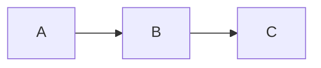

# obzur_report

AI Observability Program Report — a Hugo static site covering monitoring, observability, alerting, and incident handling for AI-agent workloads.

## Prerequisites

- [Hugo](https://gohugo.io/installation/) v0.93 or newer (extended edition recommended)
- Git

### Install Hugo on macOS

```bash
brew install hugo
```

Verify the installation:

```bash
hugo version
```

## Run the development server

```bash
hugo server
```

The site will be available at `http://localhost:1313/`. Hugo watches for file changes and live-reloads automatically.

## Build for production

```bash
hugo
```

Output is written to the `public/` directory.

## Project structure

```
.
├── config.toml                   # Hugo site configuration
├── content/
│   └── _index.md                 # Detailed structured report (homepage)
├── layouts/
│   ├── index.html                # Homepage template
│   └── _default/
│       ├── baseof.html           # Base HTML shell with Mermaid.js
│       ├── single.html           # Single page template
│       ├── list.html             # List page template
│       └── _markup/
│           └── render-codeblock-mermaid.html  # Mermaid diagram render hook
└── static/
    └── css/
        └── styles.css            # Site styles
```

## Mermaid diagrams

Mermaid diagrams are rendered client-side via CDN. Wrap diagram syntax in a fenced code block tagged `mermaid`:

````markdown

````
