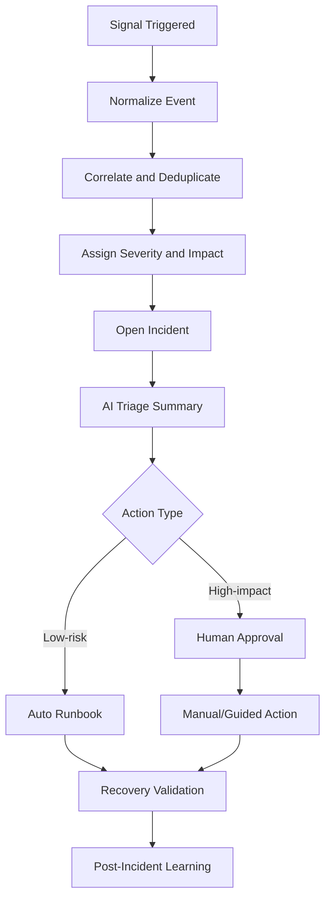
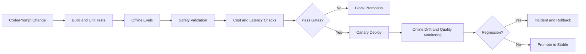

+++
title = "Detailed Structured Report"
date = "2026-03-16"
+++

## 1. Objective
Build a practical, scalable operating model for AI-agent monitoring, observability, alerting, and incident handling.

## 2. What Teams Actually Run (Pipeline Overview)
### Pipeline A: Telemetry Pipeline
1. OTel instrumentation emits logs, metrics, traces, and AI metadata.
2. OTel Collector applies redaction, enrichment, and routing rules.
3. Data lands in hot, warm, and archive stores.
4. Correlation links runtime events with deploy and config changes.

### Pipeline B: Alert and Incident Pipeline
1. Rule engines and anomaly detection evaluate telemetry.
2. Events are normalized to a common incident schema.
3. Dedup and correlation reduce duplicate pages.
4. Priority scoring routes incidents by severity and impact.
5. Incident command plane opens with context attached.

### Pipeline C: AI Quality and Safety Pipeline
1. CI runs offline eval suites against golden and adversarial datasets.
2. Safety checks validate policy, leakage, and injection controls.
3. Cost/latency checks enforce budget and SLO thresholds.
4. Promotion is blocked on failed gates.
5. Post-deploy online eval watches drift and regressions.

### Pipeline D: Triage and Remediation Pipeline
1. AI triage assistant generates summary and root-cause hypotheses.
2. Responders validate severity and blast radius.
3. Low-risk runbooks execute automatically.
4. High-impact actions require human approval.
5. Recovery checks confirm stabilization.
6. Post-incident learning updates alerts, evals, and runbooks.

## 3. Architecture (Neatly Layered)
1. Instrumentation Layer: OTel SDK/auto-instrumentation, AI telemetry fields.
2. Collection Layer: OTel Collector, masking, enrichment, routing, sampling.
3. Storage Layer: hot incident queries, warm analytics, long-term compliance archive.
4. AI Observability Layer: traces, prompt lineage, eval outcomes, token economics.
5. Incident Layer: detection, correlation, dedup, escalation, response workflows.
6. Automation Layer: runbooks, approval-gated actions, rollback controls.
7. Governance Layer: RBAC, policy-as-code, audit trails, retention controls.

## 4. End-to-End System Diagram

```mermaid
flowchart LR
  subgraph Src[Sources]
    A1[Apps and APIs]
    A2[Infra and Platform]
    A3[AI Agents and LLM Calls]
    A4[Deploy and Config Events]
  end

  subgraph Col[Collection and Correlation]
    B1[OTel Collector]
    B2[Redaction and Enrichment]
    B3[Sampling and Routing]
    B4[Correlation Engine]
  end

  subgraph Stg[Storage]
    C1[Hot Incident Store]
    C2[Warm Analytics Store]
    C3[Archive and Compliance]
  end

  subgraph Obs[AI Observability]
    D1[Trace and Tool Lineage]
    D2[Prompt Version Registry]
    D3[Quality and Safety Eval]
    D4[Cost and Latency Analytics]
  end

  subgraph Inc[Incident Response]
    E1[Detection and Scoring]
    E2[Dedup and Routing]
    E3[Incident Command]
    E4[Runbook and Remediation]
  end

  Src --> Col --> Stg
  Col --> Obs
  Obs --> Inc
  Col --> Inc
```

## 5. Incident Pipeline Diagram

## 6. AI Release Quality Gate Diagram

## 7. Usage Overview by Function
### SRE/Platform
- Own SLO burn monitoring, dedup tuning, and runbook health.

### Engineering
- Correlate incidents with release changes and traces.

### AI/ML
- Own prompt/model evals, drift monitoring, and safety regression handling.

### Security/Risk
- Validate redaction, access policies, and approval gates.

### FinOps/Leadership
- Track cost-per-outcome and reliability ROI.

## 8. 12-Month Delivery Roadmap
1. Foundation (0-4 weeks): telemetry schema, service catalog, severity policy.
2. Core telemetry (months 2-4): OTel rollout and incident routing standardization.
3. AI observability (months 4-7): traces, eval dashboards, release gating.
4. Incident intelligence (months 7-10): triage automation and dedup tuning.
5. Optimization (months 10-12): governance hardening and cost optimization.

## 9. KPIs
1. Reliability: MTTD, MTTA, MTTR, recurring incident rate.
2. Alert quality: actionable page rate, duplicate alert ratio.
3. AI operations: eval pass rate, safety incident rate, drift detection lead time.
4. Cost: observability cost per service and AI cost per successful outcome.
